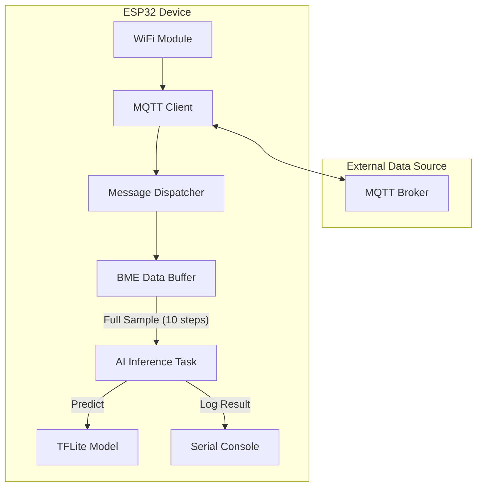

# ESP-Inferring

An ESP32-based inference engine that uses **TensorFlow Lite Micro** to perform real-time classification on sensor data received via MQTT.

## Overview

This project is designed to act as a remote inference node. It subscribes to a specific MQTT topic to receive sensor data (simulating or relaying from BME688 sensors), buffers the data until a full sample is ready, and then executes a pre-trained TFLite model to classify the input.

## Features

- **TensorFlow Lite Micro Integration**: Runs quantized (INT8) or floating-point (FP32) models directly on the ESP32.
- **PSRAM Utilization**: Allocates the TFLite tensor arena in PSRAM to support larger models (up to 512KB arena by default).
- **MQTT Data Ingestion**: Receives sensor data asynchronously via MQTT.
- **Data Buffering**: Automatically collects and aligns gas sensor data before triggering inference.

## Notes

- Only supports bme specimen data coming from `../pytorch-project/bme688_simulator.py`
- Reason for this is that cycle step is needed to align readings to the model so that the model understands whats going on.
- I didin't bother to start changing Atte's project as I simply do not have time for that 

## Architecture



## Data Flow

1.  **Ingestion**: The device subscribes to the `inferring/test` topic.
2.  **Parsing**: Incoming JSON messages containing `gas`, `temperature`, `pressure`, `humidity`, and `cycle_step_index` are parsed by the `dispatcher`.
3.  **Buffering**: The `bme_sim` module collects 10 consecutive gas readings (one per MQTT message).
4.  **Inference**: Once 10 readings are gathered, the full feature set is sent to the `AI Inference Task`.
5.  **Output**: The TFLite model processes the input, and the predicted class/score is logged to the serial output.

## Project Structure

- `main/main.c`: Entry point, initializes peripherals and tasks.
- `main/ai/`: TFLite Micro initialization and inference logic.
- `main/model/`: Pre-compiled TFLite models in C header format.
- `main/dispatcher/`: MQTT message routing and JSON parsing.
- `main/bme_sim/`: Sensor data accumulation logic.
- `main/mqtt/` & `main/wifi/`: Connectivity management.

## Configuration

### Secrets
Create a `main/secrets/secrets.h` (based on `secrets_template.h`) with your network credentials
and mqtt settings:
```c
#define WIFI_SSID "<wifi ssid>"
#define WIFI_PASS "<wifi password>"
#define MQTT_ADDRESS "mqtt://<broker ip>"
#define MQTT_PORT <port as integer>
```
- For example replace \<port> with 1883 or \<wifi ssif> with BeerCan 

### Model Selection
In `main/ai/ai.cc`, you can toggle between quantized and floating-point models:
```cpp
#define QUANT 0 // 1 for INT8, 0 for FP32
```

## Requirements

- ESP-IDF v5.x
- ESP32-S3 or other esp32
- - with PSRAM (NEEDED FOR FP32). INT8 fits inside a s3 without psram
- - For example Waveshare ESP32-S3 Pico
- TensorFlow Lite Micro (handled via `idf_component.yml`)
