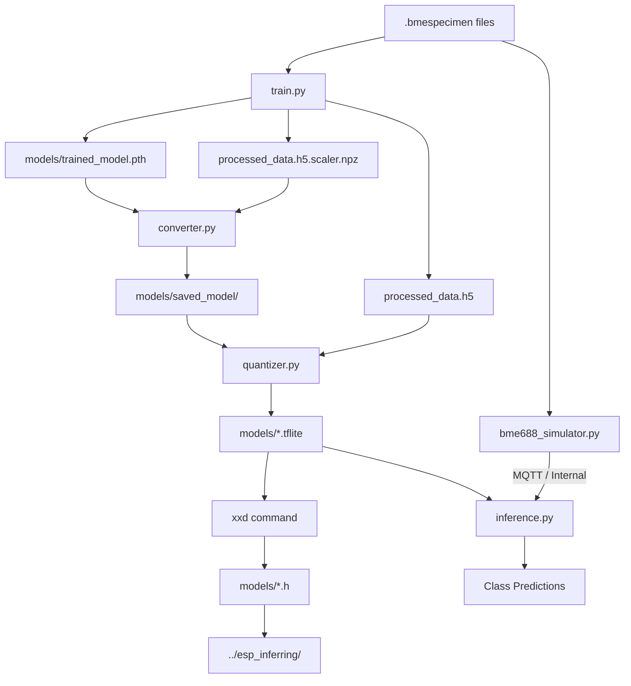

# BME688 AI Project: PyTorch to Embedded TFLite
Trainer developed by Atte Mäki-Kerttula.  
Conversion, Quantization, and Inference tools developed by Artturi Juurenheimo.

This project provides a complete pipeline for training a neural network on BME688 gas sensor data, converting the model for LiteRT (TFLite), and performing inference on PC or embedded hardware.

## 🔄 Workflow Diagram



---

## ⚙️ Setup

Install **Python 3.12.10** strictly. Newer versions (like 3.12.13) or older versions will most likely cause dependency conflicts.
- To manage multiple python versions on your machine you can use PyEnv.

### Win
```powershell
python -m venv .venvwin
.venvwin\Scripts\activate
pip install --use-deprecated=legacy-resolver -r requirements.txt
```

### Linux
```bash
python3 -m venv .venv
source .venv/bin/activate
pip install --use-deprecated=legacy-resolver -r requirements.txt
```

- *--use-deprecated=legacy-resolver* is used to ensure compatibility between pinned versions in `requirements.txt`.

---

## 🛠️ Script Usage

Run all commands from the project root directory.

### 1. `train.py`
Trains the PyTorch model. Modified to output a z-score scaler and print a class index mapping at completion so you know which index corresponds to which class.

**Basic Run:**
```bash
python train.py --data_dir data/specimendata/ --epochs 100 --model_save_path models/trained_model.pth
```

**Options:**
- `--data_dir`: Path to raw `.bmespecimen` data.
- `--processed_data_path`: Path where processed `.h5` features and `.scaler.npz` are stored (default: `processed_data.h5`).
- `--model_save_path`: Output path for the trained PyTorch `.pth` file.
- `--load_processed`: Reuse already processed data if available.
- `--hidden_sizes`: Comma-separated list of hidden layer sizes (e.g., `512,256,128`).

### 2. `converter.py`
Converts the PyTorch `.pth` model and scaler into a TensorFlow SavedModel. Normalization is embedded into the graph, so the resulting model accepts raw sensor inputs. 
  
It uses built-in defaults:
- **Input:** `models/trained_model.pth` + `processed_data.h5.scaler.npz`
- **Output:** `models/saved_model/`

```bash
python converter.py
```

### 3. `quantizer.py`
Converts the SavedModel into a `.tflite` file. Supports various quantization modes.

**Example (FP32 Mode):**
```bash
python quantizer.py --mode fp32 --output_tflite models/fp32_model.tflite
```

**Options:**
- `--input_model`: Path to SavedModel directory (default: `models/saved_model`).
- `--output_tflite`: Path where the output `.tflite` model will be saved.
- `--mode`: Quantization mode: `fp32`, `fp16`, `int8_dynamic`, or `int8_static`.
- `--data_h5`: Path to `.h5` file for representative dataset (required for `int8_static`).

### 4. `inference.py`
Runs inference using a `.tflite` model. It can consume live data from MQTT or simulate a sensor using specimen files.

**MQTT Mode:**
```bash
python inference.py --mode mqtt --model-path models/fp32_model.tflite --mqtt-host 172.27.34.12 --mqtt-port 1883 --mqtt-topic inferring/test
```

**Simulator Mode:**
```bash
python inference.py --mode simulator --model-path models/fp32_model.tflite --specimen-source data/specimendata/
```

**Options:**
- `--mqtt-host`: Mqtt host ip address
- `--mqtt-port`: Mqtt host port
- `--mqtt-topic`: Mqtt topic
- `--mode`: Running mode `mqtt` or `simulator`
- `--model-path`: Path to model
- `--spcimen-source`: 
- `--class-names`: Comma-separated labels (e.g., `clean_air,ethanol,acetone`). Match the order printed by `train.py`.

### 5. `bme688_simulator.py`
Publishes BME688 data from specimen files to MQTT, with optional added noise.

**Publish to MQTT:**
```bash
python bme688_simulator.py data/specimendata/ --mqtt-host 172.27.34.12 --mqtt-port 1883 --mqtt-topic inferring/test --noise-std 0.02 --delay 0.5
```

**Options:**
- `--mqtt-host`: Mqtt host ip address
- `--mqtt-port`: Mqtt host port
- `--mqtt-topic`: Mqtt topic
- `--noise-std`: Add relative Gaussian noise (0.0 to 1.0).
- `--loop`: Repeat the dataset indefinitely.
- `--shuffle`: Shuffle the file order.
- `--dry-run`: Log payloads to console instead of publishing to MQTT.

---

## 🔌 Embedded Deployment

To use the model in an ESP32 or similar environment, convert the `.tflite` file to a C header:

**Linux:**
```bash
xxd -i models/fp32_model.tflite > models/fp32_model.h
```

**Win (Requires WSL or Bash):**
```powershell
bash -c "xxd -i models/fp32_model.tflite > models/fp32_model.h"
```
